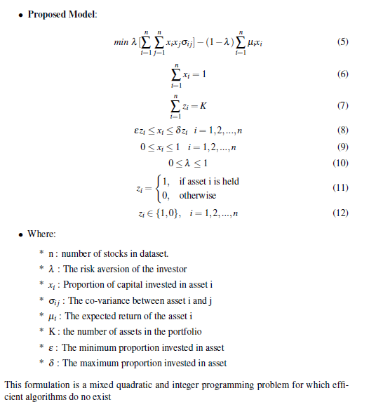
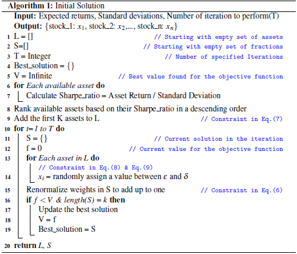

# Portfolio Optimization Problem Definition
### [Complete description of the project + code](https://github.com/taylankabbani/METAHEURISTIC-APPROACH-FOR-POP/blob/master/Description/Progress_Repo.pdf)
Financial markets are at the heart of the modern economy and they
provide an avenue for the sale and purchase of assets such as bonds,
stocks, foreign exchange, and derivatives. The prime objective of any
investor when investing capital in the stock market is to minimize the
risk involved in the trading process and maximize the profits generated,
and this objective can be met by optimally choosing a portfolio
(grouping of stocks) in which the capital among stocks is invested in
such a proportion that the profit is maximum and the risk is minimum,
this known as *Portfolio Optimization*
The traditional financial risk management approach is based on
*mean–variance model* of portfolio theory (**Markowitz**)\[1\], which
uses historical mean return and co-variance of stocks to optimize a
portfolio, therefore we can divide the Portfolio Optimization problem
(POP) into two stages. The first stage is to forecast the future return
(beliefs about the future performances) of available securities based on
historical data, and the second stage is to distribute the capital among
the chosen assets in a way to minimizes risk and maximizes profits.
# In this Study
Specific constraints will be introduced to the basic
*Markowitz* model in order to make it more adherent to the real world
trading mechanisms. The addition of these constraint will turn the model
from Quadratic Programming (QP) problem to a Mixed Integer Quadratic
Programming (MIQP) problem, which is a NP-Hard problem that can be
optimally solved using *Metaheuristic* approaches.  
*The Constrained Multi-Objective Portfolio Selection* will be applied on
new problem instances (Istanbul Stock exchange), and will be optimally
solved using a Metaheuristics approach, (**Genetic Algorithm or Tabu
Search**).

## Model

## Proposed Algorithm

